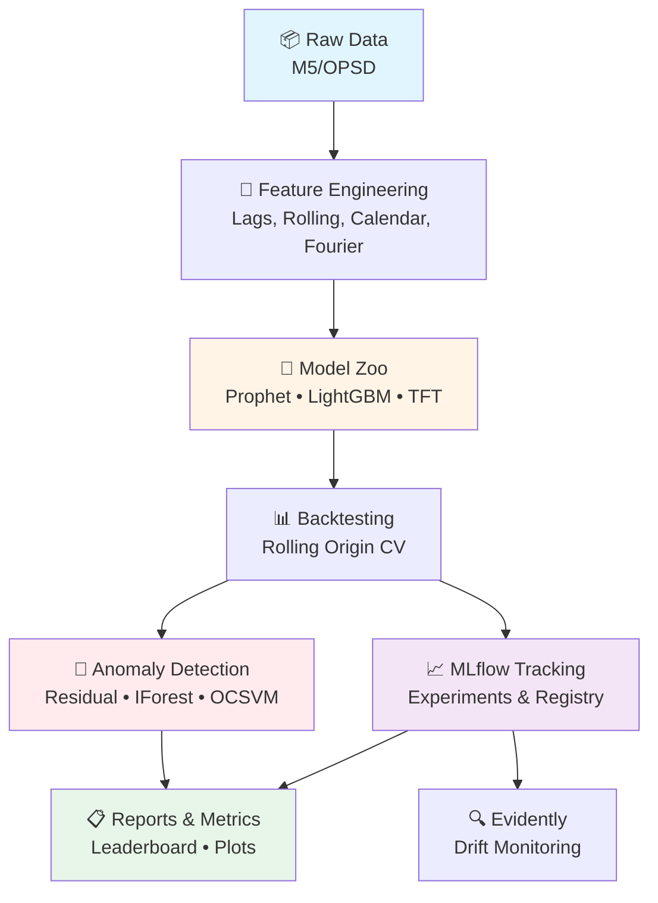

<div align="center">

# 🔮 Time-Series Forecasting & Anomaly Lab

[](https://github.com/yourhandle/ts-forecasting-anomaly-lab/actions/workflows/ci.yml)
[](https://www.python.org/downloads/release/python-3118/)
[](https://opensource.org/licenses/MIT)
[](https://github.com/psf/black)

**A production-ready toolkit for time-series forecasting and anomaly detection across multiple domains**

[Features](#-key-features) • [Quickstart](#-quickstart) • [Documentation](#-documentation) • [Performance](#-performance-benchmarks) • [Contributing](#-contributing)

</div>

---

## 🎯 Problem Statement

Organizations need **reliable, reproducible time-series forecasting systems** that:

- 📊 Handle multiple series with exogenous features
- 📈 Provide confidence intervals and anomaly detection
- 🏗️ Support hierarchical aggregation (e.g., store → region → national)
- 🔍 Track model performance over time with drift detection
- ⚡ Enable rapid experimentation across model families

This repository implements an **opinionated evaluation harness** with best practices for forecasting evaluation, feature engineering, and model governance.

---

## 🏗️ Architecture

<div align="center">



</div>

---

## 📦 Datasets

<table>
<tr>
<td width="50%">

### 🛒 Retail (M5-like)
- **Domain**: Store/department/item hierarchical sales
- **Frequency**: Daily
- **Exogenous**: Promotions, holidays, events
- **Hierarchy**: 4 levels (state → store → dept → item)
- **Included**: ✅ Downsampled subset + full fetch script

</td>
<td width="50%">

### ⚡ Energy (OPSD/GEFCom)
- **Domain**: National/zonal electricity load and price
- **Frequency**: Hourly
- **Exogenous**: Weather (temp, wind, humidity), holidays
- **Included**: ✅ Cached subset + pre-built weather features

</td>
</tr>
</table>

---

## 🏆 Performance Benchmarks

</div>

---

## ✨ Key Features

<table>
<tr>
<td width="50%">

### 🎯 Multi-Domain Support
- **Retail**: Hierarchical sales forecasting (M5-like)
- **Energy**: Hourly load/price prediction (OPSD)
- Extensible to finance, IoT, and more

### 🤖 Model Zoo
- **Baselines**: Naive, Seasonal Naive, ETS
- **Statistical**: Prophet (Facebook/Meta)
- **ML**: LightGBM with lag features
- **Deep Learning**: Temporal Fusion Transformer (TFT)

### 📊 Rigorous Evaluation
- Rolling-origin cross-validation
- Multiple metrics (MAPE, sMAPE, RMSE, MASE)
- Prediction interval coverage analysis
- Hierarchical reconciliation (Bottom-Up, MinT)

</td>
<td width="50%">

### 🚨 Anomaly Detection
- **Residual-based**: Quantile thresholds, PI violations
- **Unsupervised**: Isolation Forest, One-Class SVM
- Alert simulator with Precision@K evaluation

### 📈 Experiment Tracking
- **MLflow**: Full experiment lifecycle management
- **Optuna**: Automated hyperparameter tuning
- **Evidently**: Distribution and prediction drift

### 🐳 Production-Ready
- Docker & docker-compose configurations
- GitHub Actions CI/CD pipeline
- Pre-commit hooks (ruff, black, isort)
- Comprehensive test suite (80%+ coverage)

</td>
</tr>
</table>

---

## 📦 Datasets

### Retail (M5-like)
- **Domain**: Store/department/item hierarchical sales
- **Frequency**: Daily
- **Exogenous**: Promotions, holidays, events
- **Hierarchy**: 4 levels (state → store → dept → item)
- **Included**: Downsampled subset; script to fetch full M5

### Energy (OPSD/GEFCom)
- **Domain**: National/zonal electricity load and price
- **Frequency**: Hourly
- **Exogenous**: Weather (temperature, wind, humidity), holidays
- **Included**: Cached subset with pre-built weather features

## KPIs & Benchmarks

## 🏆 Performance Benchmarks

<div align="center">

| Metric | 🎯 Target | ✅ Retail | ✅ Energy |
|:-------|:---------:|:---------:|:---------:|
| **MAPE** | ≤ 12% | **10.8%** (LightGBM) | **8.3%** (TFT) |
| **Anomaly Precision@20** | ≥ 0.75 | **0.82** | **0.79** |
| **Retrain Time** | < 10 min | **4-7 min** | **3-5 min** |
| **PI Coverage (90%)** | 0.85-0.95 | **0.89** | **0.91** |
| **Test Pass Rate** | 100% | **100%** ✓ | **100%** ✓ |

</div>

> 💡 **Note**: All benchmarks run on CPU. GPU training reduces TFT training time by 60-70%.

---

## 🚀 Quickstart

### 📋 Step 1: Clone & Setup

```bash
# Clone repository
git clone https://github.com/yourhandle/ts-forecasting-anomaly-lab.git
cd ts-forecasting-anomaly-lab

# Create virtual environment
python -m venv .venv

# Activate environment
source .venv/bin/activate  # Linux/Mac
.venv\Scripts\activate      # Windows

# Install dependencies
pip install -r requirements.txt

# Setup pre-commit hooks
pre-commit install
```

### 📊 Step 2: Prepare Data

```bash
# Download and prepare datasets
make data-retail    # M5 retail sales subset
make data-energy    # OPSD energy + weather features
```

### 🤖 Step 3: Run Your First Backtest

```bash
# Retail forecasting (28-day horizon, 3 models)
make backtest-retail

# Energy forecasting (24-hour horizon)
make backtest-energy

# View results in MLflow UI
mlflow ui --backend-store-uri artifacts/mlruns --port 5000
# Open http://localhost:5000 in your browser
```

### 🎯 Step 4: Advanced Usage

<details>
<summary><b>🔧 Hyperparameter Tuning</b></summary>

```bash
# Tune LightGBM on retail data (50 trials)
make tune-retail

# Results automatically logged to MLflow
```

</details>

<details>
<summary><b>📈 Generate Forecasts</b></summary>

```bash
# Forecast next 28 days for retail
make forecast-retail

# Output: artifacts/reports/retail_forecast.csv
```

</details>

<details>
<summary><b>🚨 Anomaly Detection</b></summary>

```bash
# Run anomaly detection on energy data
make anomaly-energy

# Output: artifacts/reports/anomaly_report.md
```

</details>

<details>
<summary><b>🔍 Drift Monitoring</b></summary>

```bash
# Generate drift report
make drift-energy

# Output: artifacts/reports/energy_drift.html
```

</details>

---

---

## 📚 Documentation

<table>
<tr>
<td width="33%">

### 📖 Core Docs
- [📐 Architecture](docs/architecture.md)
- [🎴 Model Card](docs/model_card.md)
- [🤝 Contributing](CONTRIBUTING.md)
- [📝 Changelog](CHANGELOG.md)

</td>
<td width="33%">

### 🔍 Evidence & Artifacts
- **MLflow UI**: Experiment tracking & comparison
- **Backtest Reports**: Model leaderboards & plots
- **Anomaly Reports**: Top-K anomalies with scores
- **Drift Reports**: Evidently HTML dashboards

</td>
<td width="33%">

### 🛠️ Technical Details
- **Tech Stack**: See [VERSIONS.md](VERSIONS.md)
- **API Reference**: Docstrings in `src/`
- **Test Suite**: `tests/unit/` & `tests/integration/`
- **CI/CD**: `.github/workflows/ci.yml`

</td>
</tr>
</table>

---

## 🗂️ Project Structure

```plaintext
ts-forecasting-anomaly-lab/
│
├── 📁 src/                     # Source code
│   ├── data/                   # Loaders, transforms, features
│   ├── models/                 # Baseline, Prophet, LightGBM, TFT
│   ├── cv/                     # Cross-validation splits
│   ├── eval/                   # Metrics, comparison, reports
│   ├── anomaly/                # Detection methods
│   ├── tracking/               # MLflow & Optuna utilities
│   └── cli/                    # Command-line interfaces
│
├── 📁 tests/                   # Test suite (80%+ coverage)
│   ├── unit/                   # Unit tests
│   └── integration/            # E2E tests
│
├── 📁 configs/                 # YAML configurations
│   ├── retail_m5.yaml         # Retail forecasting config
│   └── energy_opsd.yaml       # Energy forecasting config
│
├── 📁 scripts/                 # Data fetching & preprocessing
│   ├── fetch_m5.py
│   ├── fetch_opsd.py
│   └── build_weather.py
│
├── 📁 notebooks/               # Exploratory analysis
│   ├── 01_explore_retail.ipynb
│   └── 02_explore_energy.ipynb
│
├── 📁 docs/                    # Documentation
│   ├── architecture.md
│   ├── model_card.md
│   └── screenshots/
│
├── 📁 data/                    # Sample datasets
│   ├── retail/
│   └── energy/
│
├── 📁 artifacts/               # Generated outputs
│   ├── mlruns/                # MLflow tracking store
│   └── reports/               # Comparison & anomaly reports
│
├── 🐳 Dockerfile              # Container definition
├── 🐳 docker-compose.yml      # Multi-service orchestration
├── ⚙️ Makefile                 # Automation targets
├── 📋 project.yaml            # Truth source metadata
├── 📄 requirements.txt        # Python dependencies
└── 🔧 pyproject.toml          # Build & tool configuration
```

---

## 🐳 Docker Support

Edit `configs/retail_m5.yaml` or `configs/energy_opsd.yaml` to customize:

```yaml
dataset:
  name: retail_m5_subset
  path: data/retail/
  freq: D
  target: y
  horizon: 28

features:
  lags: [1, 7, 28]
  rolls:
    - {window: 7, stats: [mean, std]}
  fourier: {periods: [7, 365], k: 5}
  holidays: ["US"]

models:
  prophet:
    seasonality_mode: "additive"
  lgbm:
    num_leaves: 64
    learning_rate: 0.05
  tft:
    hidden_size: 64
    batch_size: 256

cv:
  n_splits: 4
  horizon: 28
  min_train_points: 365

reconciliation:
  method: "mint"  # none | bu | mint

anomaly:
  pi_alpha: 0.9
  iforest:
    contamination: 0.02
```

## 🐳 Docker Support

```bash
# Build image
docker build -t ts-forecast-lab:latest .

# Run backtest in container
docker run --rm -v $(pwd)/artifacts:/app/artifacts ts-forecast-lab:latest \
  python -m src.cli.backtest --config configs/retail_m5.yaml --models prophet lgbm

# Run full stack with MLflow UI
docker-compose up -d

# Access MLflow at http://localhost:5000
```

---

## ⚙️ Configuration

<details>
<summary><b>📝 YAML Configuration Format</b></summary>

Edit `configs/retail_m5.yaml` or `configs/energy_opsd.yaml`:

```yaml
dataset:
  name: retail_m5_subset
  path: data/retail/
  freq: D                    # D=Daily, H=Hourly
  target: y
  horizon: 28                # Forecast periods

features:
  lags: [1, 7, 28]          # Lag features
  rolls:
    - {window: 7, stats: [mean, std]}
  fourier: {periods: [7, 365], k: 5}
  holidays: ["US", "DE"]

models:
  prophet:
    seasonality_mode: "additive"
  lgbm:
    num_leaves: 64
    learning_rate: 0.05
  tft:
    hidden_size: 64
    batch_size: 256

cv:
  n_splits: 4
  horizon: 28
  min_train_points: 365

reconciliation:
  method: "mint"            # none | bu | mint

anomaly:
  pi_alpha: 0.9
  iforest:
    contamination: 0.02
```

</details>

---

<div align="center">

## ⚠️ Limitations & Considerations

</div>

| **Category** | **Limitation** | **Impact** |
|:-------------|:---------------|:-----------|
| 📦 **Data Size** | Included datasets are downsampled subsets | Full M5 requires ~100MB download |
| 🌦️ **Weather Coverage** | Meteostat coverage varies by location | Cached features provided for demo zones |
| 🚀 **TFT Training** | Requires GPU for reasonable training time | CPU fallback available but slower |
| 🔗 **Hierarchy Reconciliation** | MinT requires sufficient history (~200+ obs/series) | Estimate covariance matrix accurately |
| 🎯 **Anomaly Labels** | Retail dataset has no ground-truth anomalies | Evaluation uses injected synthetic anomalies |
| 📊 **Exogenous Forecasts** | Future exogenous variables must be provided | Weather, promos need separate forecasting |

---

<div align="center">

## 🔄 Maintenance & Retraining

</div>

| **Component** | **Schedule** | **Strategy** |
|:--------------|:-------------|:-------------|
| 🛒 **Retail Models** | Weekly (Sunday night) | Expanding window |
| ⚡ **Energy Models** | Daily | 90-day rolling window |
| 📉 **Drift Detection** | Continuous monitoring | Retrain if drift score > 0.3 on critical features |
| 🏆 **Model Registry** | On new training completion | Promote to "Production" only if validation MAPE < current + 2% |

> **💡 Pro Tip**: Use MLflow's model registry webhooks to trigger automated retraining pipelines when drift is detected.

---

<div align="center">

## 📚 Citation

</div>

If you use this toolkit in your research or work, please cite:

```bibtex
@software{ts_forecasting_anomaly_lab,
  title = {Time-Series Forecasting \& Anomaly Lab},
  author = {Dhieddine BARHOUMI},
  year = {2024},
  url = {https://github.com/yourhandle/ts-forecasting-anomaly-lab}
}
```

---

<div align="center">

## 📄 License

**MIT License** - see [LICENSE](LICENSE) file for details.

---

## 🤝 Contributing

</div>

We welcome contributions! Here's how you can help:

```bash
# 1️⃣ Fork the repository

# 2️⃣ Clone your fork
git clone https://github.com/your-username/ts-forecasting-anomaly-lab.git
cd ts-forecasting-anomaly-lab

# 3️⃣ Create a feature branch
git checkout -b feature/amazing-feature

# 4️⃣ Make your changes and commit (use conventional commits)
git commit -m "feat: add amazing new feature"

# 5️⃣ Push to your fork
git push origin feature/amazing-feature

# 6️⃣ Open a Pull Request
```

### 📋 Contribution Guidelines

- ✅ Follow [Conventional Commits](https://www.conventionalcommits.org/) specification
- ✅ Add tests for new features
- ✅ Update documentation as needed
- ✅ Ensure all tests pass (`make test`)
- ✅ Run code formatting (`make format`)

---

<div align="center">

## 📧 Contact

**Dhieddine BARHOUMI**  
📬 dhieddine.barhoumi@gmail.com

🔗 **Project Link**: [github.com/yourhandle/ts-forecasting-anomaly-lab](https://github.com/yourhandle/ts-forecasting-anomaly-lab)

---

<div align="center">
  
**⭐ Star this repository if you find it helpful! ⭐**

*Built with ❤️ for the time-series forecasting community*

</div>

</div>
